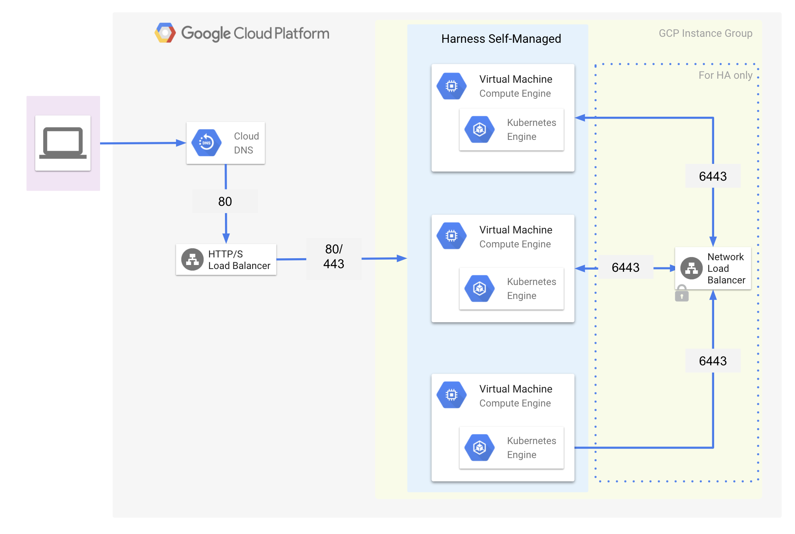

Harness Self-Managed Enterprise Edition is an end-to-end solution for continuous, self-managed delivery. You can install and update Harness Self-Managed Enterprise Edition using online or offline (air-gapped) methods. This topic provides a summary comparison of Harness SaaS and self-managed offerings and describes the options for self-managed delivery.

### Compare Harness SaaS with self-managed

The following tables provide a summary of key differences between Harness SaaS and self-managed products.

**Table 1. Impacts**

|  | **Harness SaaS** | **Harness Self-Managed Enterprise Edition** |
| --- | --- | --- |
| **Platform Management** | Harness | Customer |
| **Hardware Cost** | — | ~$25,000 |
| **Hardware Maintenance** | — | Required |
| **Continuous Updates** | Daily | Weekly |
| **Security** | TLS/SSL Outbound | TLS/SSL Outbound |
| **Data Governance** | No Corporate Data Leaves Firewall | No Corporate Data Leaves Firewall |
| **Avg. Onboarding Time** | Days | Weeks |
| **Avg. Site Readiness** | Days | Weeks |
| **Avg. Support Res. Time** | Days | Weeks |

**Table 2. Modules and Features**

| **Module** | **Helm Install** | **KOTS Install** | **Notes** |
| --- | :-: | :-: | --- |
| Continuous Delivery | **✓** | **✓** | GitOps is not included. |
| Security Testing Orchestration | **✓** | X |  |
| Service Reliability Management | **✓** | **✓** | Error Tracking is not included. |
| Continuous Integration | **✓** | **✓** |  |
| Feature Flags | **✓** | **✓** |  |
| Cloud Costs Management | X | X |  |
| Harness Chaos Engineering | X | X |  |
| Harness Platform | **✓** | **✓** | Policy as Code (Harness Policy Engine) and Custom Dashboards are not included. |

### Install on Kubernetes

Harness Self-Managed Enterprise Edition is installed in a Kubernetes cluster in the following configuration.

To install Harness Self-Managed Enterprise Edition in a Kubernetes cluster, use the following instructions:

1. For Self-Managed Enterprise Edition with Helm, see [Install Harness Self-Managed Enterprise Edition Using Helm](../self-managed-helm-based-install/install-harness-self-managed-enterprise-edition-using-helm-ga.md).
2. For Self-Managed Enterprise Edition with KOTS, see [Install Self-Managed Enterprise Edition Using KOTS](../deploy-with-kots/installing-self-managed-enterprise-edition-using-kots.md).

### Install on virtual machine

Harness Self-Managed Enterprise Edition is installed on virtual machines (VMs) in the following configuration.

| **GCP Architecture** | **AWS Architecture** |
| :-: | :-: |
|  |  |

To install Harness Self-Managed Enterprise Edition on a virtual machine, see the following topics:

- [Self-Managed Enterprise Edition > Virtual Machine > Infrastructure](../vm-self-managed-category/virtual-machine-on-prem-infrastructure-requirements.md)
- [Self-Managed Enterprise Edition > Virtual Machine > Installation](../vm-self-managed-category/virtual-machine-on-prem-installation-guide.md)

