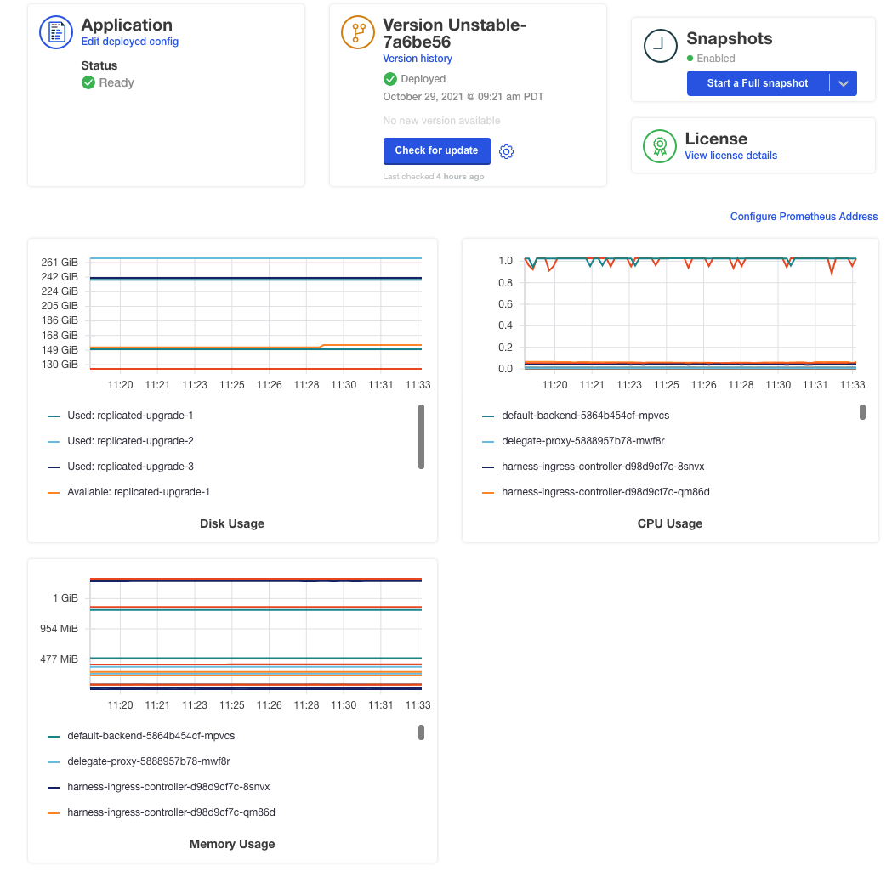
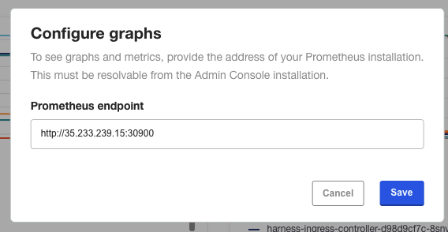
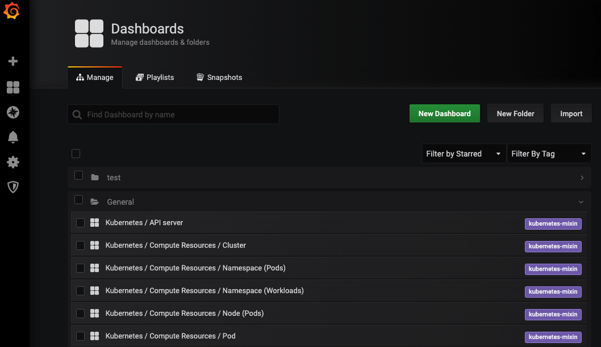
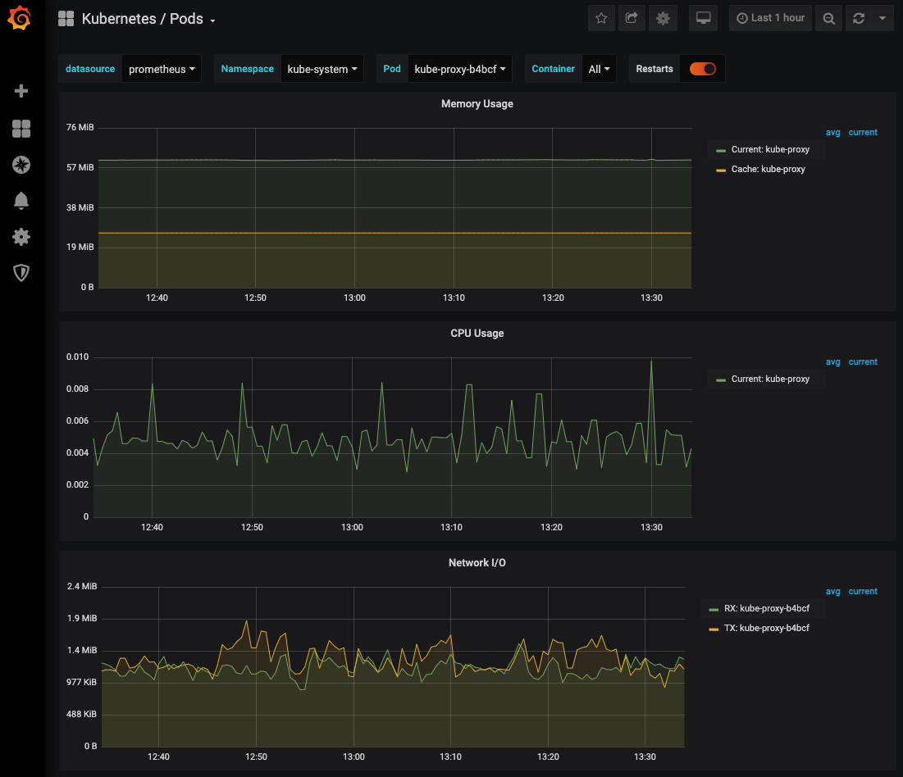

You can monitor your Harness Self-Managed Enterprise Edition installation and receive alerts on metrics such as CPU, memory, and disk usage.

### Monitoring overview

The Harness Self-Managed Enterprise Edition monitoring options available depend on whether you are running Harness Self-Managed Enterprise Edition - Virtual Machine or Harness Self-Managed Enterprise Edition - Kubernetes Cluster.

Harness Self-Managed Enterprise Edition - Virtual Machine comes with built in monitoring using Prometheus, Grafana, and Alertmanager, but Harness Self-Managed Enterprise Edition - Kubernetes Cluster requires that you set up monitoring on your own.

### Monitoring Harness Self-Managed Enterprise Edition - virtual machine

Monitoring is included in Harness Self-Managed Enterprise Edition - Virtual Machine by default.

The KOTS admin tool for a running version of Harness Self-Managed Enterprise Edition - Virtual Machine displays Prometheus monitoring:



When you installed Harness Self-Managed Enterprise Edition - Virtual Machine, you were provided with Prometheus, Grafana, and Alertmanager ports and passwords in the output of the installer. For example:


```
The UIs of Prometheus, Grafana and Alertmanager have been exposed on NodePorts 30900, 30902 and 30903 respectively.  
To access Grafana use the generated user: xxxxx password of admin: xxxxx.
```
To view these addresses, log into the VM running Harness, and then view the Kubernetes services running in the `monitoring` namespace:


```
kubectl get svc -n monitoring
```

The output will be something like this:


```
NAME                    TYPE        CLUSTER-IP    EXTERNAL-IP   PORT(S)                      AGE  
alertmanager-main       NodePort    10.96.2.240   <none>        9093:30903/TCP               282d  
alertmanager-operated   ClusterIP   None          <none>        9093/TCP,9094/TCP,9094/UDP   282d  
grafana                 NodePort    10.96.2.252   <none>        3000:30902/TCP               282d  
kube-state-metrics      ClusterIP   None          <none>        8443/TCP,9443/TCP            282d  
node-exporter           ClusterIP   None          <none>        9100/TCP                     282d  
prometheus-adapter      ClusterIP   10.96.1.45    <none>        443/TCP                      282d  
prometheus-k8s          NodePort    10.96.2.94    <none>        9090:30900/TCP               282d  
prometheus-operated     ClusterIP   None          <none>        9090/TCP                     282d  
prometheus-operator     ClusterIP   None          <none>        8080/TCP                     282d
```
#### Prometheus

The Prometheus port number is taken from the `prometheus-k8s` service (in this example, `30900`).

Combine that port number with the public IP address for Harness Self-Managed Enterprise Edition and you have the Prometheus endpoint.

If you have a load balancer configured, update the configuration to support the `prometheus-k8s` port number. In the KOTS admin tool, in **Application**, click **Configure Prometheus Address**.

In **Configure graphs**, enter the URL using the public IP address and the Prometheus port number.



Click **Save**. The graphs appear.

#### Grafana

The Grafana port is listed by running `kubectl get svc -n monitoring`:


```
grafana                 NodePort    10.96.2.252   <none>        3000:30902/TCP               
```

Combine that port number with the public IP address for Harness Self-Managed Enterprise Edition and you have the Grafana endpoint. For example `http://35.233.239.15:30902`.

Log into Grafana using the generated username and password you received when you installed Harness Self-Managed Enterprise Edition:


```
To access Grafana use the generated user: xxxxx password of admin: xxxxx.
```
If you do not have the username and password, log into the VM hosting Harness Self-Managed Enterprise Edition and run the following:


```
kubectl get secrets grafana-admin -n monitoring -o yaml
```

Log in and navigate to **Dashboards**. Click a default dashboard or create a new one.



For example, open the **Kubernetes / Pods** dashboard.



See [Grafana docs](https://grafana.com/docs/) for information on creating dashboards.

For information on querying Prometheus, see [Querying Prometheus](https://prometheus.io/docs/prometheus/latest/querying/basics/).

#### Alertmanager

The Alertmanager port is listed by running `kubectl get svc -n monitoring`:

```
alertmanager-main       NodePort    10.96.2.240   <none>        9093:30903/TCP
```

Combine that port number with the public IP address for Harness Self-Managed Enterprise Edition and you have the Alertmanager endpoint. For example,  `http://35.233.239.15:30903`.

See [Alerting Rules](https://prometheus.io/docs/prometheus/latest/configuration/alerting_rules/) from Prometheus for details on setting up alerts.

### Monitoring Harness Self-Managed Enterprise Edition - Kubernetes cluster

Harness does not provide default monitoring for Harness Self-Managed Enterprise Edition.

You can deploy a Prometheus server and Grafana to monitor Harness Self-Managed Enterprise Edition. For steps on setting up monitoring using Prometheus, Grafana, and Alertmanager, see [Prometheus](https://kots.io/kotsadm/monitoring/prometheus/) in the KOTS documentation.

If you have an existing Prometheus setup, in the KOTS admin tool, click **Configure Prometheus Address** and then enter the Prometheus URL endpoint.

### Availability monitoring

The following table shows the two available URL endpoints. These are microservices with external endpoints; ingress is configured by default.

In these examples, `<domain name>` represents your vanity URL (for example, `mycompany.harness.io`). If your load balancer directs internal traffic for `app.harness.io`, you can use that address in the URLs.


| **Service Name** | **Endpoint** | **Response** |
| :-- | :-- | :-- |
| Verification | `https://<domain name>/verification/health` | `{"metaData":{},"resource":"healthy","responseMessages":[]}` |
| NextGen Manager | `https://<domain name>/ng/api/health` | `{"status":"SUCCESS","data":"healthy","metaData":null,"correlationId":"a38c51ac-07ec-4596-b40b-4cc9487f8506"}` |

You can use the following methods to monitor other microservices in Self-Managed Enterprise Edition:

* MongoDB. There are many ways to monitor MongoDB instances. For example, you can monitor your MongoDB database with Grafana and Prometheus. For a summary, see the article [MongoDB Monitoring with Grafana & Prometheus](https://devconnected.com/mongodb-monitoring-with-grafana-prometheus/).

* Disk/Memory. Use the [Kubernetes pod dashboard](https://kubernetes.io/docs/tasks/access-application-cluster/web-ui-dashboard/).

